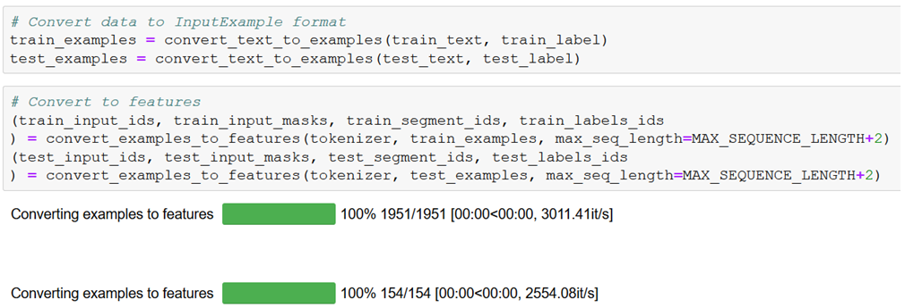
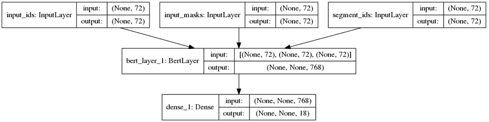
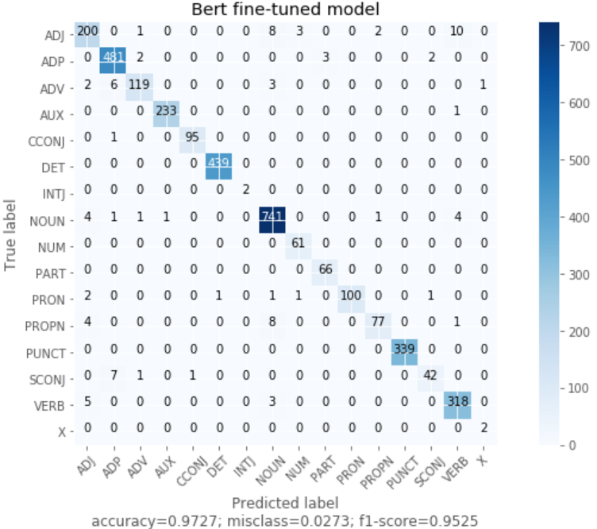

# Α Pos Tagger trained on UD treebank with fine-tuning a BERT model

The task of this work is to develop a part-of-speech (POS) tagger for the English language of the <a href="http://universaldependencies.org/">Universal Dependencies</a> treebanks, by fine-tuning a pre-trained BERT model, using Keras and Tensorflow Hub module.

## Transformer  Models
Following a different approach from feature-based learning, **Transfer learning** - pre-training a neural network model on a known task, 
and then performing fine-tuning - using the trained neural network as the basis of a new purpose-specific model, was firstly known in the
field of computer vision but can be also useful in many natural language tasks. A new simple network architecture, the **Transformer**,
based solely on attention mechanisms, dispensing with recurrence and convolutions entirely was proposed by paper 
<a href="https://arxiv.org/pdf/1706.03762.pdf">“Attention Is All You Need”</a>. 

BERT makes use of Transformer, to learn contextual representations of words (or sub-words) which can then be fine-tuned with just one additional output layer to create state-of-the-art models for a wide range of NLP tasks.

## Alignment (token -> tag)
According to <a href="https://arxiv.org/pdf/1706.03762.pdf">“BERT: Pre-training of Deep Bidirectional Transformers for Language Understanding”</a> paper, for Named Entity Recognition task (section  4.3):

>For fine-tuning, we feed the final hidden representation Ti ∈ RH for each token i into a classification layer over the NER label set. The predictions are not conditioned on the surrounding predictions (i.e., non-autoregressive and no CRF). To make this compatible with WordPiece tokenization, we feed each CoNLL-tokenized input word into our WordPiece tokenizer and use the hidden state corresponding to the first sub-token as input to the classifier. For example:
>```
>Jim   Hen   ##son was a puppet ##eer
>I-PER I-PER X     O   O O      X
>```
>Where no prediction is made for X. Since the WordPiece tokenization boundaries are a known part of the input, this is done for both 
training and test.

So for our POS tagging task, due to **WordPiece** tokenizer we must take special care for the correct alignment of token to tag. 
For this we keep an **original-to-tokenized map** which can then be used to project labels to the tokenized representation. 
This is done in function *convert_single_example()* and we can see how it works with an example:
```
Original tokens: ['creative', 'commons', 'makes', 'no', 'warranties', 'regarding', 'the', 'information', 'provided', ',', 'and', 'disclaims', 'liability', 'for', 'damages', 'resulting', 'from', 'its', 'use', '.']
BERT tokens: ['[CLS]', 'creative', 'commons', 'makes', 'no', 'warrant', '##ies', 'regarding', 'the', 'information', 'provided', ',', 'and', 'disc', '##lai', '##ms', 'liability', 'for', 'damages', 'resulting', 'from', 'its', 'use', '.', '[SEP]']
labels: ['-PAD-', 'PROPN', 'PROPN', 'VERB', 'DET', 'NOUN', 'VERB', 'DET', 'NOUN', 'VERB', 'PUNCT', 'CCONJ', 'VERB', 'NOUN', 'ADP', 'NOUN', 'VERB', 'ADP', 'DET', 'NOUN', 'PUNCT', '-PAD-']
orig_to_tok_map: [0, 1, 2, 3, 4, 6, 7, 8, 9, 10, 11, 12, 15, 16, 17, 18, 19, 20, 21, 22, 23, 24]
```
Here we have 2 tokens that are splitted to sub-tokens by WordPiece tokenizer:
```
'warranties' -> 'warrant', '##ies'
'disclaims' -> 'disc', '##lai', '##ms'
```
And this is where our **alignment code** keeps the appropriate sub-token. For example, the original matching `'warranties' -> 'NOUN'`, 
becomes after aligning `'##ies' -> 'NOUN'`. We tested the other (proposed in <a href="https://github.com/google-research/bert/blob/master/run_classifier.py">run_classifier.py</a>) possible alignment `'warrant' -> 'NOUN'`, but with worse results! So we use the hidden state corresponding to the **last** sub-token as input to the classifier.

## BERT Representation 
We use the appropriate functions to convert our dataset to BERT features: `input_ids, input_masks, segment_ids`. Then we one-hot encode labels.



## Model Architecture 



## Confusion matrix



## Tag an unknown sentence
Lets tag an unknown sentence: `'Word embeddings provide a dense representation of words and their relative meanings.'`:

```
Word in BERT layer  | Initial word   : Predicted POS-tag
-------------------------------------------------------------
word                | word           : NOUN           
##s                 | embeddings     : NOUN           
provide             | provide        : VERB           
a                   | a              : DET            
dense               | dense          : ADJ            
representation      | representation : NOUN           
of                  | of             : ADP            
words               | words          : NOUN           
and                 | and            : CCONJ          
their               | their          : DET            
relative            | relative       : ADJ            
meanings            | meanings       : NOUN           
.                   | .              : PUNCT          
```

Here we can see how tokenization and our alignment code works, and how good the prediction is even for word `'embeddings'`, 
which was unknown and very difficult for the other models to tag correctly!

## Acknowledgement
<a href="https://eclass.aueb.gr/courses/INF210/">Natural Language Processing</a> course is part of the MSc in Computer Science of the Department of Informatics, <a href="https://aueb.gr/en">Athens University of Economics and Business</a>. The course covers algorithms, models and systems that allow computers to process natural language texts and/or speech.
